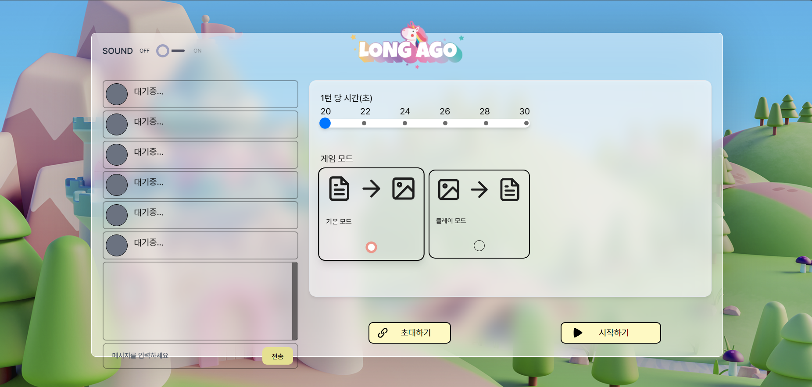
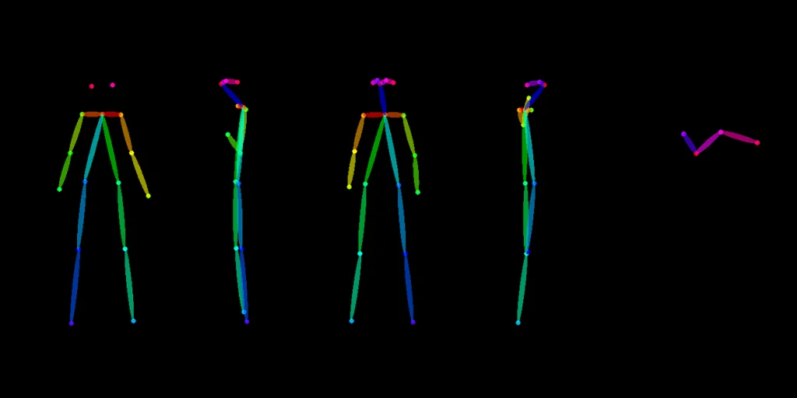
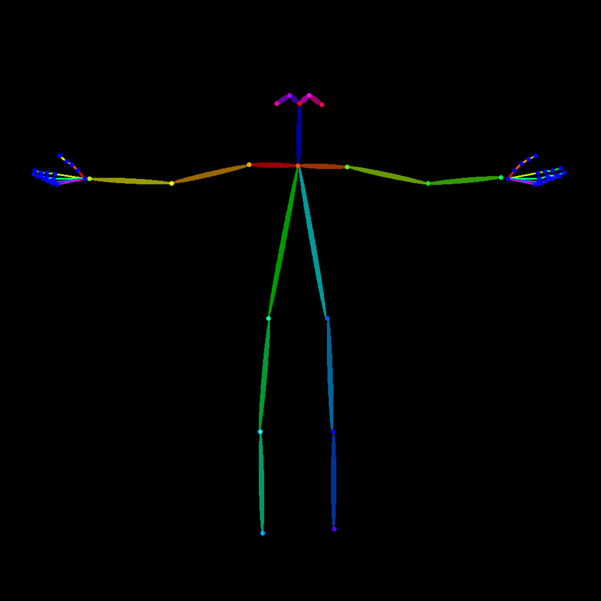
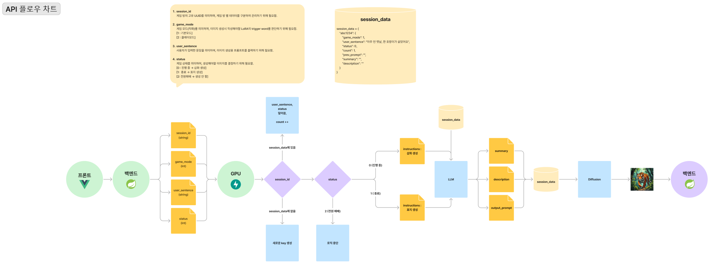

# 아주 먼 옛날


# 개요

- **아주 먼 옛날 이란?:** LLM과 이미지 생성 AI를 이용한 온라인 게임 플랫폼
- **목표:** LLM과 이미지 생성 AI를 이용한 실시간 온라인 게임 제공
- **주요 기술:** Spring Boot, Redis, JPA, Docker, AWS, Nginx , LLM, Image Generation Model


## 게임 룰

1. 모든 유저는 10점의 포인트와 4장의 이야기 카드, 1장의 결말 카드를 가진다.
이야기 카드는 '소녀', '비밀통로', ‘거대함' 과 같은 단어 카드들이다.
결말 카드는 ‘그들을 보면서 그는 커피를 마시며 구경했습니다.’와 같은 문장 카드들이다.
2. 자신의 턴에 자신이 소지한 카드 중 하나를 선택하여 이야기를 만들 수 있습니다.
ex) 한 ‘소녀’가 살았습니다
3. 다음 사람은 그 전 사람의 이야기와 개연성에 맞게 이야기를 만들어야 합니다.
ex) 그 소녀는 정말 예뻤습니다
4. 이야기를 만들 때마다 개연성이 있는지를 투표로 판단합니다.
5. 투표가 반대가 나오거나 제한 시간 안에 이야기를 만들지 못하면 점수가 깎이고, 이야기를 만들어내면 점수를 얻습니다.
6. 결말 카드를 내면 대량의 점수를 받을 수 있습니다.  

## 웹 페이지

---

- **링크:** [i12b101.p.ssafy.io](http://i12b101.p.ssafy.io/)

- 메인 페이지
    
    
    
    **기능**
    
    1. 닉네임 설정
    2. 버튼 클릭을 통한 아바타 이미지 변경
    3. 유저 회원가입 및 로그인 기능 (우 최상단)
    4. Sound ON-OFF 토글 버튼 (좌 상단)
    5. AI로 생성한 BGM
    6. 게임 시작 버튼
    7. 게임 방법을 슬라이드 형식으로 보여줌
    

- 로비 페이지
    
    
    
    **기능**
    
    1. WebRTC기반 실시간 연결
    2. 채팅
    3. 게임 시간 조정
    4. 초대 링크
    5. 게임 모드 선택 (삽화의 그림체 변경)
    6. 최대 인원(6명) 이후 접속 차단
    7. 방장이 방에서 이탈시 접속 시간이 가장 빠른 사람에게 방장 권한을 넘김
    - **게임 진행은 2명 이상일 때 시작 가능합니다.**
    

- 게임 페이지
    
    
    
    **기능** 
    
    1. 타이머 (타이머가 끝날 때 까지 미제출 시 감점)
    2. 긴장감 (이야기 진행시 상승하며, 35% 이상부터 결말카드를 제출할 수 있음)
    3. 감정표현 (움직이는 감정표현)
    4. 채팅 (일반 채팅 모드 & 이야기 제출 모드의 2가지 모드를 tab키로 전환)
    5. 투표 (과반수 가결시 이야기 등록 및 +2점, 부결시 이야기 폐기 및 -1점)
    6. 결말 카드 새로고침
    7. 동화책에 이야기 등록 및 삽화 생성
    
    

# 페이지 별 기능 정리


# API 명세서

---

[API 명세서](https://chestnut-license-d1d.notion.site/API-e37eeaa0e8b04a8bbcfff15c471ed48f?pvs=4) 

[API 기준문서 [Image Generation]](https://chestnut-license-d1d.notion.site/API-Image-Generation-18cca332a535805dac97f498d54cbe4a?pvs=4) 

---

# **BackEnd**

---

## **1. 핵심 기술 스택**

- **Spring Boot 기반 백엔드**
- **Redis 캐싱 활용**
- **Spring Security 적용**
- **WebClient 기반 외부 API 통신**
- **RESTful API 컨트롤러 구현**
- **데이터베이스 연동 (JPA & Redis 혼용)**
- **DTO 및 서비스 계층 분리**

---

## **2. 기능별 정리**

### **📌 1) Redis 캐싱 및 게임 데이터 관리**

- **핵심 기능:**
    - 게임 데이터를 **Redis를 이용한 인메모리 방식으로 저장**하여 빠른 접근 가능 (DB에서 정보를 가져오는 것보다 인메모리 방식인 Redis가 속도가 빠름)
    - TTL(Time To Live) 설정을 적용하여 **오래된 데이터 자동 삭제 (메모리 공간 관리)**
    - **게임 데이터(카드, 장면 등) 캐싱**하여 성능 최적화 (DB로 접근해서 직접 접근하는 것보다 Redis에 데이터를 캐싱해서 조회를 하는 것이 훨씬 빠름)

---

### **📌 2) API 응답 통일화**

- **핵심 기능:**
    - API 응답을 **일관된 형식으로 통일** (성공/실패 응답 구조화)
    - 프론트엔드 협업 시 **예측 가능한 응답 구조 제공**

---

### **📌 3) 스프링 시큐리티 기반 보안 적용**

- **핵심 기능:**
    - Spring Security를 이용한 **인증/인가 시스템 구축**
    - **BCryptPasswordEncoder**를 이용한 **비밀번호 암호화**

---

### **📌 4) 게임 및 장면 관리**

- **핵심 기능:**
    - **게임 생성, 종료 기능 구현**
    - **장면(Scene) 관리 API 제공**
    - 게임 시작 시 **카드 분배 로직 및 카드 셔플 기능** 적용
    (카드 분배 : 이야기 카드 4장, 결말 카드 1장 씩 분배 받음
    이야기 카드와 결말 카드는 분배 되기 전에 모두 셔플 해서 분배하고
    이야기 카드에 속성이 5개 있는데 여기서 인물 속성은 무조건 1개, 나머지 속성은 사람마다 무작위로 속성을 배정받아 속성 별 카드를 한장 씩 얻을 수 있음.)
    - 결말 카드 리롤
    (결말 카드는 최대 3번 리롤을 돌릴 수 있음.)
    - 사용했던 카드나 리롤을 돌린 카드들은 다시 게임에서 다른 사람이 뽑거나 할 수 없음. (삭제됨)
    - **투표 반대 결과 처리 및 장면 저장 로직 포함
    (**투표 반대 시 카드는 사용되지 않음, redis에 임시 저장됐던 scene 데이터도 삭제됨.)
    (찬성 시 이미지 생성에 사용됐던 카드는 삭제됨.)

---

### **📌 5) 프롬프트 필터링**

- **핵심 기능:**
    - **사용자 입력 프롬프트에서 카드 키워드 포함 여부 확인
    (사용자가 입력한 프롬포트에서 카드가 중복돼서 사용되었는지
    카드가 아무것도 사용되진 않았는지 검증 로직)**
    - 한국어의 불규칙 동사, 형용사의 유사어들을 판단하기 위해 한국어 형태소 분석기 라이브러리를 활용해서 형태소 분석을 한 후
    거기에서 추출한 데이터로 유사어들을 탐지해 카드 키워드가 사용됐는지 확인
    - **욕설 필터링 오픈소스를 활용하여 부적절한 단어 차단
    (욕1111설 같은 중간에 숫자나 특수문자가 들어간 욕설도 필터링 가능)**

---

### **📌 6) 이미지 생성 파이프라인**

- **핵심 기능:**
    - WebClient를 이용한 **GPU 서버와 통신**
    - **이미지 생성 요청을 GPU 서버로 전달 후 결과 반환**
    - GPU 서버 응답 시간을 1분으로 늘림. (기본 30초)
    - 응답 받는 데이터의 크기를 2MB로 늘림 (기본 256KB)

---

### **📌 7) 데이터베이스 연동**

- **핵심 기능:**
    - **JPA & Redis를 혼용하여 데이터 관리**
    - JPARepository를 활용해서 CRUD 기능 구현
    - **PostgreSQL 같은 RDB와 연결 가능**
    - JPA를 통해 SQLI(sql injection) 방지
    - `application.properties`에서 **DB 연결 정보 설정 가능**

---

## 3. 백엔드 개발 명세서

[Backend 개발 명세서](https://chestnut-license-d1d.notion.site/Backend-1a0ca332a53580519a7ec3446fba6d89?pvs=4)


---


# AI

## 1. 핵심 기술 스택

- **LLM**
- **Image Generation**

---

## 2. LLM


### 이미지 프롬프트 생성

<aside>

**사용자 입력**: 호랑이가 방심한 틈을 타서 지팡이로 호랑이의 머리를 내리쳤다. 호랑이는 매우 아파한다

**결과** 

```bash

**요약 스토리:**
호랑이는 표창을 피하고 닌자를 앞발로 공격했다. 닌자는 피를 흘리며 지팡이를 잡고 힘겹게 서 있다. 호랑이가 방심한 틈을 타서 지팡이로 호랑이의 머리를 내리쳤다. 호랑이는 매우 아파한다.

**Description:**
- 호랑이: [강력한, 위협적인], [기분 나쁘다], [사냥 중], [사냥감 찾기]
- 숲: [어두운, 고요한], [비바람], [호랑이와 닌자의 추격전]
- 시간: [저녁], [어두운 시간대]
- 배경: [숲 속 깊은 곳]
- 닌자: [신속한, 은밀한], [호랑이와 대치 중], [표창 날리기]
- 닌자: [피를 흘리며], [지팡이를 잡고], [힘겹게 서 있다]
- 호랑이: [아파하며], [지팡이 공격에 맞음]

```

```bash
**이미지 프롬프트:**
A fierce tiger, its massive body trembling in pain, lies sprawled on the damp forest floor, clutching its bloodied head with its powerful paws. Its golden eyes, wide with shock and agony, flicker between rage and disorientation as a deep wound seeps crimson into its thick fur. Its growls, low and guttural, resonate through the stormy night, mixing with the distant rumble of thunder.

A battered ninja, breathing heavily, stands just a few feet away, gripping a bloodied wooden staff. His body is hunched, his muscles taut, and his knuckles whiten as he clenches his weapon, his stance unsteady from exhaustion and injuries. His dark robes, torn and stained with dirt and blood, cling to his weary frame. His narrowed eyes remain fixed on the tiger, wary of any sudden retaliation. The tension in the air is suffocating, the silence between them broken only by the rustling of wet leaves and the tiger’s labored breathing.

The storm above swirls violently, casting flickering shadows across the dense jungle. Rain drizzles down, washing away streaks of blood from the ninja’s bruised hands. The faint glow of lightning illuminates the raw desperation in his gaze, a lone warrior standing against a mighty beast in a brutal clash for survival.
```

**생성된 이미지**


호랑이가 방심한 틈을 타서 지팡이로 호랑이의 머리를 내리쳤다. 호랑이는 매우 아파한다

</aside>

### ComfyUI Node - [github](https://github.com/Yeonri/ComfyUI_LLM_Are_You_Listening)

<aside>


1. 이전 스토리 요약 + 사용자의 이야기 → 최신화된 요약 스토리
2. 최신화된 요약 스토리 + 이전 이미지 프롬프트 + description → 최신화된 description
3. 최신화된 요약 스토리 + 최신화된 description + 이전 이미지 프롬프트 + 사용자의 이야기 → 이미지 프롬프트
- **`*description*`**: 이전 이야기에 존재하는 객체들의 상세 정보들을 기억하여 이미지 프롬프트의 일관성 제공 및 이미지 프롬프트의 객체 상세 표현에 사용
- description 예시
    
    **Description:**
    - 호랑이: [강력한, 위협적인], [기분 나쁘다], [사냥 중], [사냥감 찾기]
    - 숲: [어두운, 고요한], [비바람], [호랑이와 닌자의 추격전]
    - 시간: [저녁], [어두운 시간대]
    - 배경: [숲 속 깊은 곳]
    - 닌자: [신속한, 은밀한], [호랑이와 대치 중], [표창 날리기]
    - 닌자: [피를 흘리며], [지팡이를 잡고], [힘겹게 서 있다]
    - 호랑이: [아파하며], [지팡이 공격에 맞음]
    
</aside>

## 3. Image Generation

---

> **워크플로우**
> 


> **‘아주 먼 옛날’만의 캐릭터 생성**
> 


카드 리스트에 있는 인물 카드에 대해 일관적으로 생성되게 하기 위해 **자체적으로 캐릭터를 생성**하고, **독자적으로 학습 진행**

⇒ 이야기가 진행되며 **인물의 생김새가 바뀌는 것을 방지**


.png)

.png)

.png)

.png)

.png)





.png)

.png)

.png)

.png)

.png)


.png)

.png)

.png)

.png)

.png)

> **아바타**
> 

**그림체를 학습시킨 모델을 이용하여 독자적인 아바타 캐릭터 생성**

.png)

 

---

# Infra


## 1. 핵심 기술 스택

- Docker
- Docker Compose
- GitLab CI/CD
- Nginx
- AWS ( EC2, RDS, S3 )
- Java, Spring


---

## **2. 기능별 정리**

### 📌 1) 컨테이너화 & 오케스트레이션 ( Docker, Docker Compose )

- **핵심 기능:**
    - FE(프론트엔드)와 BE(백엔드)를 각각 컨테이너화 하여 독립적으로 배포할 수 있도록 설계됨
    - DockerHub를 이용하여 이미지 버전 관리
    - Docker Compose를 통하여 일관된 환경에서 애플리케이션을 배포 가능

### 📌 2) CI/CD 자동화 (GitLab CI/CD)

- **핵심 기능:**
    - stages(build, push, cleanup, deploy)를 나누어 단계별 실행
    - 특정 파일 변경 시 필요한 단계만 실행하도록 최적화
    - Main 서버와 Test 서버를 분리하여 운영하여, 병합 전 Test 환경 제공
    - 빌드 프로세스를 Main 서버에서 분리하여  Main 서버 리소스 최적화

### 📌 3) Nginx를 이용한 이미지 캐싱

- **핵심 기능:**
    - 비로그인 기반 게임이며, 불특정 다수에게 다양한 이미지가 제공되기 때문에 S3를 퍼블릭으로 공개하는 것은 적절하지 않다고 판단
    - 기존의 CDN 방식에서 착안  Nginx를 이용하여 이미지 캐시 처리
    - crontab을 활용하여 캐시가 만료된 이미지 자동 삭제
    - 운영 비용 절감 효과와 사용자 업로드 경험 개선

### 📌 4) 병렬 처리를 통한 이미지 업로드 속도 개선

- **핵심 기능:**
    - 게임 당 이미지가 최소 5개에서 최대 25개 까지 나올 수 있음
    - 순차적 업로드 방식으로는 서비스 불가 판단
    - 병렬 처리를 통하여 업로드 시간을 최소화
    - 사용자 다운로드 경험 개선

### 📌 5) 싱글톤 방식으로 S3Client 객체 생성

- **핵심 기능:**
    - 하나의 S3Client 객체를 생성
    - 메모리 낭비 방지
    - 속도 측면 개선
    - 동시성 문제를 **4)** 의 병렬 처리를 통하여 최소화

## 3. 포팅 메뉴얼

[포팅 메뉴얼](https://www.notion.so/b7e90b8172104cd0903b4036616e2830?pvs=4)


# 부록


## 1. API 플로우 차트

[](https://embed.figma.com/board/TYy930EXyiNXhLXcqLpqXt/%ED%94%8C%EB%A1%9C%EC%9A%B0%EC%B0%A8%ED%8A%B8?node-id=0-1&t=pPPvbGq5Bm0pM5JL-1&embed-host=notion&footer=false&theme=system)

## 2. ERD

[](
https://www.figma.com/board/0AFnvp8LXEE0GN5JbCR7X9/%EC%98%9B%EB%82%A0%EC%98%9B%EC%A0%81-DB?node-id=0-1&t=WoBzQUsxk9FLqW1K-1)