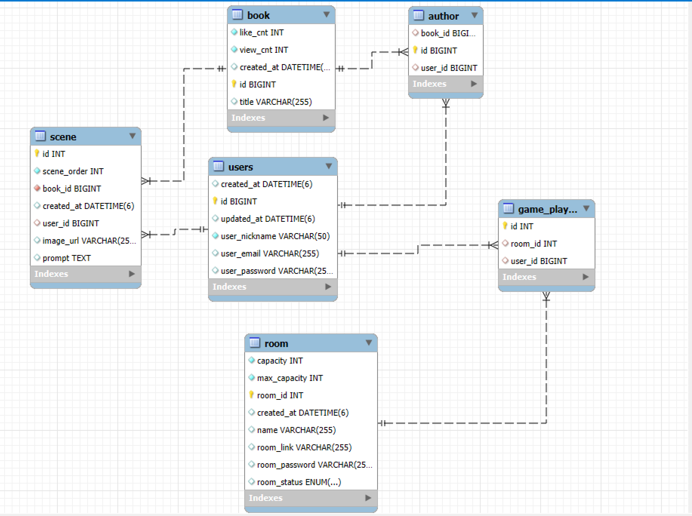

# 프로젝트 학습 기록

## 1. JPA Entity 설계 및 비즈니스 로직 구현


### 학습 내용
- JPA를 활용하여 데이터베이스 설계와 매핑을 공부했습니다.

- 유저(User), 책(Book), 장면(Scene), 방(Room), 게임 플레이어(Game Player) 등 주요 엔티티를 설계하였습니다.

- @Entity, @Table, @Column 등의 어노테이션을 사용하여 테이블과 매핑하는 방법을 학습했습니다.

- 특히 `@ManyToOne`, `@OneToMany`와 같은 관계 설정 및 데이터베이스 연관관계 매핑에 대해 깊이 있게 학습하였습니다.

- Auditing 기능(@CreatedDate, @LastModifiedDate)을 도입하여 생성일과 수정일을 자동 관리하는 방법을 배웠습니다.

### 학습한 이유
- 프로젝트에서 데이터베이스 구조와 실제 구현 간 일관성을 유지하기 위해 필요했습니다.

- 비즈니스 로직을 효율적으로 처리하기 위해 JPA의 연관관계를 올바르게 설정하는 방법을 학습하고 적용했습니다.

---

## 2. Spring Security를 활용한 로그인 및 인증


### 학습 내용
- Spring Security를 도입하여 사용자 인증과 권한 관리에 대해 공부했습니다.

- 사용자 비밀번호를 안전하게 관리하기 위해 `BCryptPasswordEncoder`로 비밀번호를 암호화하는 방법을 배웠습니다.

- SecurityConfig 파일을 작성하여 URL 접근 권한을 설정하고, 로그인 성공 및 실패 시 커스텀 응답을 구현하는 방법을 학습했습니다.

- CustomUserDetails 클래스를 구현하여 Spring Security와 사용자 정보를 연결하는 방법을 이해했습니다.

### 학습한 이유
- 사용자 인증과 권한 관리는 애플리케이션 보안에서 중요한 부분이기 때문에 도입했습니다.

- 기본적인 로그인 처리 외에도 프로젝트 요구사항에 맞게 응답 메시지를 커스터마이징하고자 했습니다.

---

## 3. API 응답 일관성 확보
### 학습 내용
- 프론트엔드와의 원활한 데이터 통신과 유지보수를 위해 API 응답 형식을 일관되게 유지하는 방법을 학습하고 구현했습니다.

- `ApiResponse`와 `ApiResponseUtil` 클래스를 작성하여 모든 API 응답에서 통일된 구조를 제공하도록 설계했습니다.

- 응답에는 성공 여부(`success`), 상태 코드(`status`), 메시지(`message`), 데이터(`data`), 요청 경로(`path`), 타임스탬프(`timestamp`)를 포함했습니다.

### 주요 구현
1. **`ApiResponse` 클래스**
    - 제네릭 타입(`T`)을 사용하여 다양한 데이터 타입을 지원하도록 설계했습니다.

    - 응답 메시지에 필요한 필드를 정의하여 프론트엔드에서 응답을 쉽게 파싱하고 활용할 수 있도록 했습니다.

    ```java
    @Data
    @Builder
    public class ApiResponse<T> {
        private boolean success;         // 성공 여부
        private int status;              // HTTP 상태 코드
        private String message;          // 메시지
        private T data;                  // 실제 데이터
        private String timestamp;        // 응답 시간
        private String path;             // 요청 경로
    }
    ```

2. **`ApiResponseUtil` 클래스**
    - 성공 및 실패 응답을 손쉽게 생성하기 위한 유틸리티 클래스입니다.

    - 타임스탬프와 요청 경로(`path`)를 자동으로 추가하여 일관된 응답을 제공합니다.

    ```java
    public class ApiResponseUtil {

        // 성공 응답
        public static <T> ResponseEntity<ApiResponse<T>> success(T data, String message, HttpStatus status, String path) {
            ApiResponse<T> response = ApiResponse.<T>builder()
                    .success(true)
                    .status(status.value())
                    .message(message)
                    .data(data)
                    .timestamp(LocalDateTime.now().toString())
                    .path(path)
                    .build();

            return ResponseEntity.status(status).body(response);
        }

        // 실패 응답
        public static <T> ResponseEntity<ApiResponse<T>> failure(String message, HttpStatus status, String path) {
            ApiResponse<T> response = ApiResponse.<T>builder()
                    .success(false)
                    .status(status.value())
                    .message(message)
                    .data(null)
                    .timestamp(LocalDateTime.now().toString())
                    .path(path)
                    .build();

            return ResponseEntity.status(status).body(response);
        }
    }
    ```

### 학습한 이유
- 프로젝트 요구사항에 따라 프론트엔드와 백엔드 간 통신이 명확하고 직관적이어야 했습니다.

- 일관된 응답 형식은 디버깅과 유지보수를 더 쉽게 해줍니다.
- 성공과 실패를 명확히 구분하며 필요한 정보를 전달할 수 있는 구조를 제공하기 위해 학습하고 구현했습니다.

### 적용 예시
- 회원가입 API에서 성공/실패 응답을 `ApiResponseUtil`을 통해 통일된 형식으로 반환하였습니다.

    ```java
    @PostMapping("/signup")
    public ResponseEntity<?> signup(@RequestBody SignUpDto signUpDto, HttpServletRequest request) {
        if (userService.findByEmail(signUpDto.getEmail()).isPresent()) {
            return ApiResponseUtil.failure("이미 가입된 이메일입니다.", HttpStatus.CONFLICT, request.getRequestURI());
        }

        User newUser = new User();
        newUser.setEmail(signUpDto.getEmail());
        newUser.setPassword(encoder.encode(signUpDto.getPassword()));
        newUser.setNickname(signUpDto.getNickname());
        userService.saveUser(newUser);

        return ApiResponseUtil.success(null, "회원가입 성공", HttpStatus.CREATED, request.getRequestURI());
    }
    ```

### 결과
- 모든 API 응답에서 일관된 형식을 유지할 수 있었고, 프론트엔드 개발자들과의 협업 효율성이 크게 향상되었습니다.

- 디버깅 및 로깅 과정에서도 응답 데이터를 쉽게 분석할 수 있었습니다.
