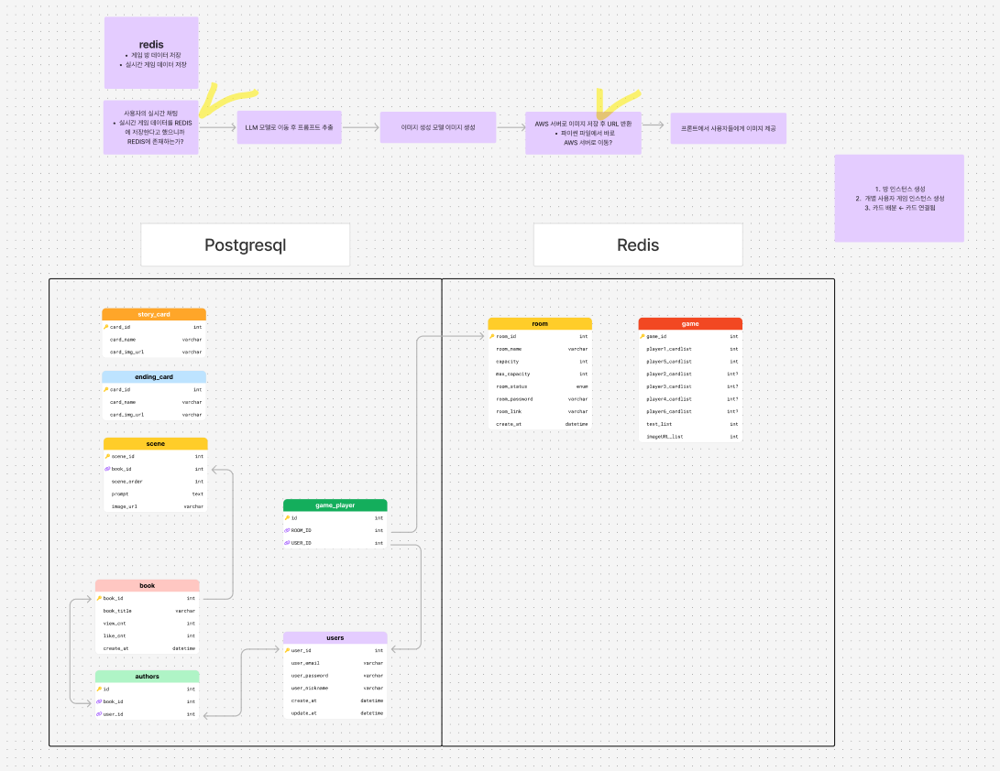

## [1. Figma 목업](https://www.figma.com/design/uPMjPwQJlPSzqVMvJHrkQr/%EC%98%9B%EB%82%A0-%EC%98%9B%EC%A0%81%EC%97%90?node-id=262-357&p=f&t=bVnow5LtTYMi1fnl-0)

## [2. 플로우 차트](https://www.figma.com/board/TYy930EXyiNXhLXcqLpqXt/%ED%94%8C%EB%A1%9C%EC%9A%B0%EC%B0%A8%ED%8A%B8?node-id=0-1&t=pPPvbGq5Bm0pM5JL-1)

## [3. ERD](https://www.figma.com/board/0AFnvp8LXEE0GN5JbCR7X9/%EC%98%9B%EB%82%A0%EC%98%9B%EC%A0%81-DB?node-id=0-1&t=WoBzQUsxk9FLqW1K-1)

## 4. 시스템 아키텍쳐

## 5. 간트 차트

