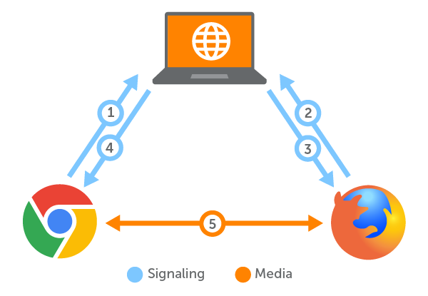

## 1. 사용자 이탈 방지를 위한 Vue 3 애니메이션 효과
사용자 이탈을 줄이고 애플리케이션에 머무르게 하기 위해 애니메이션을 활용하였습니다.

### a. Transition 컴포넌트
- **목적**: 컴포넌트 및 요소의 입장과 퇴장 애니메이션 추가
- **mode 종류 및 차이점**:
  - `in-out`: 새 요소의 애니메이션이 먼저 실행되고 기존 요소의 애니메이션이 실행됩니다.
  - `out-in`: 기존 요소의 애니메이션이 끝난 후 새 요소의 애니메이션이 실행됩니다.
  - `default`: 두 요소의 애니메이션이 동시에 실행됩니다.
- **name 지정 및 역할**:
  - `name` 속성을 사용하여 CSS 클래스 네임을 지정하며, 이를 기반으로 진입(`enter`) 및 퇴장(`leave`) 애니메이션 스타일을 정의합니다.

- **구현**:
  ```vue
  <template>
    <transition name="fade" mode="out-in">
      <div v-if="show" class="animated-box">게임에 오신 것을 환영합니다!</div>
    </transition>
  </template>

  <script>
  export default {
    data() {
      return {
        show: true,
      };
    },
  };
  </script>

  <style>
  @apply .transition-opacity .duration-500;
  .fade-enter-from, .fade-leave-to {
    @apply opacity-0;
  }
  .fade-enter-to, .fade-leave-from {
    @apply opacity-100;
  }
  </style>
  ```

### b. TailwindCSS를 활용한 커스텀 애니메이션
- **구현 방법**: TailwindCSS의 `@keyframes`와 `animation` 클래스를 사용하여 커스텀 애니메이션 제작
  ```css
  @layer utilities {
    @keyframes bounce {
      0%, 20%, 50%, 80%, 100% {
        transform: translateY(0);
      }
      40% {
        transform: translateY(-30px);
      }
      60% {
        transform: translateY(-15px);
      }
    }

    .bounce-animation {
      animation: bounce 1s infinite;
    }
  }
  ```
- 카드 뒤집기 또는 버튼 클릭과 같은 사용자 상호작용에 적용.

### c. 사용한 라이브러리
- **TailwindCSS**: 간편하게 애니메이션 효과를 추가하고 디자인 일관성을 유지.
- **GSAP**: 타임라인과 세밀한 애니메이션 제어를 위해 활용.

### d. 베스트 프랙티스
- 애니메이션은 과하지 않고 목적에 맞게 사용.
- 성능 테스트를 통해 끊김 없는 전환을 보장.

## 2. WebRTC 시그널링 서버를 활용한 4-6명 통신
### [webRTC 참고 블로그](https://velog.io/@jsb100800/%EA%B0%9C%EB%B0%9C-WebRTC-SpringBoot-Vue.js%EB%A5%BC-%ED%99%9C%EC%9A%A9%ED%95%9C-Group-Video-Call)




### a. 시그널링 개요
- **목적**: WebRTC 연결을 설정하기 위해 세션 설명(SDP) 및 ICE 후보 교환.
- **흐름**:
  1. 사용자가 게임에 참여 요청을 보내면 시그널링 서버로 전달.
  2. 서버가 다른 참가자들에게 시그널링 데이터를 브로드캐스트.
  3. 피어 간 ICE 후보를 교환하여 연결 완료.

### b. 서버 구현
- **기술**: WebSocket 기반의 Node.js 서버
- **코드 예제**:
  ```javascript
  const WebSocket = require('ws');
  const wss = new WebSocket.Server({ port: 8080 });

  wss.on('connection', (ws) => {
    ws.on('message', (message) => {
      // 연결된 모든 클라이언트에게 브로드캐스트
      wss.clients.forEach((client) => {
        if (client !== ws && client.readyState === WebSocket.OPEN) {
          client.send(message);
        }
      });
    });
  });
  ```

### c. Vue 3에서 WebRTC 적용
- **WebRTC 연결 로직**:
  ```vue
  <template>
    <div>
      <video ref="localVideo" autoplay muted></video>
      <video ref="remoteVideo" autoplay></video>
    </div>
  </template>

  <script>
  export default {
    data() {
      return {
        localStream: null,
        peerConnection: null,
      };
    },
    methods: {
      async startWebRTC() {
        this.localStream = await navigator.mediaDevices.getUserMedia({ video: true, audio: true });
        this.$refs.localVideo.srcObject = this.localStream;

        this.peerConnection = new RTCPeerConnection();

        // 로컬 트랙 추가
        this.localStream.getTracks().forEach((track) => {
          this.peerConnection.addTrack(track, this.localStream);
        });

        // 원격 트랙 설정
        this.peerConnection.ontrack = (event) => {
          this.$refs.remoteVideo.srcObject = event.streams[0];
        };

        // 시그널링 서버와 통신하여 ICE 후보 및 SDP 교환
      },
    },
    mounted() {
      this.startWebRTC();
    },
  };
  </script>
  ```

### d. 다중 사용자 연결 처리
- **방 관리**:
  - 시그널링 서버에서 방(Room) 개념을 구현하여 게임별로 연결 분리
  - 각 방은 최대 6명의 참가자를 지원
- **충돌 방지**:
  - 각 게임 인스턴스에 고유 방 ID 생성
  - 클라이언트는 저장된 방 ID를 사용하여 재참여 가능

### e. 디버깅 팁
- 브라우저 콘솔 로그를 활용하여 SDP 및 ICE 후보 교환 확인
- 직접 연결 실패 시 TURN 서버 설정 확인

## 3. Nginx 웹 서버 설정 및 애플리케이션 배포
프로젝트를 온라인에서 사용할 수 있도록 Nginx 웹 서버를 설정하고 애플리케이션을 배포하였습니다.

### a. Nginx 설정
- **설치**: Linux 서버에 Nginx 설치
  ```bash
  sudo apt update
  sudo apt install nginx
  ```
- **기본 설정**:
  ```bash
  server {
    listen 80;
    server_name yourdomain.com;

    location / {
      root /var/www/html;
      index index.html;
      try_files $uri /index.html;
    }

    location /ws/ {
      proxy_pass http://localhost:8080;
      proxy_http_version 1.1;
      proxy_set_header Upgrade $http_upgrade;
      proxy_set_header Connection "upgrade";
    }
  }
  ```

### b. 웹 애플리케이션 배포
- **빌드 과정**:
  1. `npm run build` 명령어로 프로덕션 파일 생성
  2. `scp` 명령어로 파일을 서버에 복사
  ```bash
  scp -r dist/* user@server:/var/www/html/
  ```
- **Nginx 재시작**:
  ```bash
  sudo systemctl restart nginx
  ```

### c. 보안 및 최적화
- **SSL/TLS**:
  - Certbot을 사용하여 SSL 인증서 발급 및 관리
    ```bash
    sudo apt install certbot python3-certbot-nginx
    sudo certbot --nginx
    ```
- **캐싱**: 정적 파일에 캐싱 헤더 설정
- **오류 처리**: 404 및 500 오류를 위한 커스텀 페이지 제공

### d. 현재 배포 상태
- 웹 애플리케이션이 설정된 임시서버 고정ip에서 정상적으로 작동(http://34.64.83.164/)

