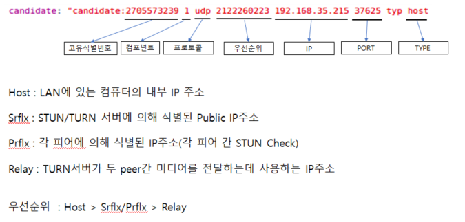
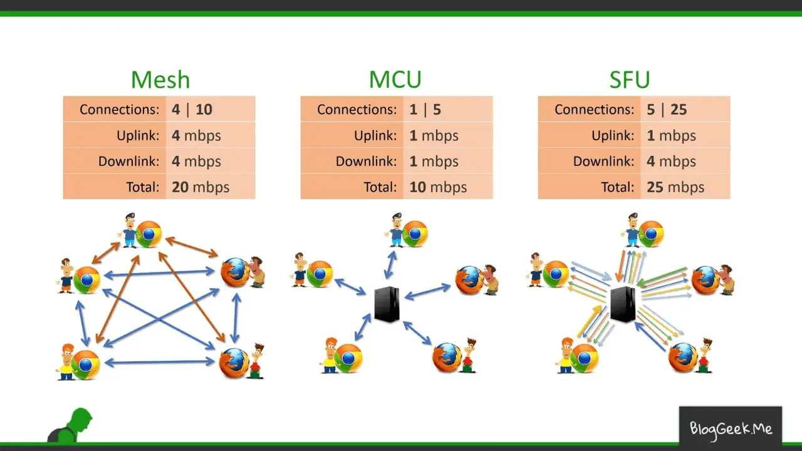
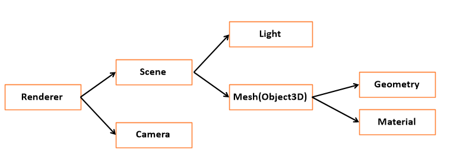
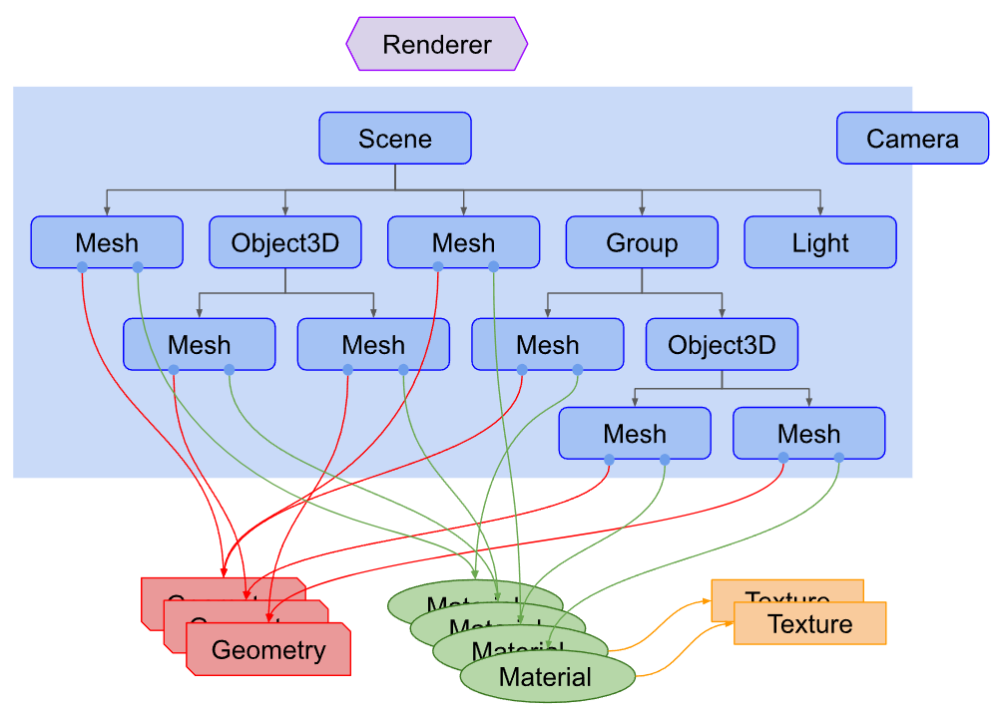

# 1. Client간 PeerConnection을 위한 WebRTC
## **WebRTC(Web Real Time Communication)**

- 서버를 최대한 거치지 않고 P2P로 브라우저나 단말 간에 데이터를 주고받는 기술의 웹표준
    
    웹에서 실시간 미디어 스트림을 송수신할 수 있는 유일한 표준이고, 또 유일한 P2P 표준이다.
    
    WebRTC는 표준임과 동시에 표준을 구현한 오픈소스의 프로젝트 이름이다.
    

### WebRTC의 용어

- Signaling Server
    - Peer 간 *SDP, **ice candidate를 교환하기 위한 중계 서버로,
        
        맨 처음 Peer간의 Connection을 만들 때 사용되는 Server
        
- *SDP (Session Description Protocol)
    - 해상도, 형식, 코덱, 암호화등의 멀티미디어 컨텐츠의 연결을 위한 메타데이터 설명
- **ICE Candidate
    - ICE : P2P 간 다이렉트 통신을 위한 기술로 통신을 위한 최적의 경로 탐색 프레임워크
    - ICE Candidate : 데이터 교환을 위한 경로 후보들로 SDP 결정 후 최적의 ICE를 선택하여 통신
    
    
    

### WebRTC의 Peer간 연결 방식



### 1. Mesh 방식

**특징**

- 앞서 설명한 `Signaling Server`, `STUN Server`, `TURN Server`를 사용하는 **전형적인 P2P `WebRTC` 구현 방식이다.**
- **1:1 연결 혹은 소규모 연결에 적합하다.**

**장점**

- Peer간의 `Signaling` 과정만 서버가 중계하기 때문에 **서버의 부하가 적다.**
- 직접적으로 Peer간 연결되기 때문에 **실시간 성이 보장**된다.

**단점**

- 연결된 Client의 수가 늘어날 수록 **Client의 과부하가 급격하게 증가한다!**
- 간단하게 생각해봐도 N명이 접속한 화상회의라면, 클라이언트 각각에서 N-1개의 연결을 유지해야 하기 때문이다.

### 2. MCU(Multi-point Control Unit) 방식

**특징**

- 다수의 송출 미디어 데이터를 **`Media Server`에서 혼합(muxing) 또는 가공(transcoding)하여 수신측으로 전달하는 방식.**
- **P2P 방식 X, Server와 Client 간의 peer를 연결한다.**
- `Media Server`의 매우 높은 컴퓨팅 파워가 요구된다.

**장점**

- **Client의 부하가 크게 줄어든다.**
- **N:M 구조에서 사용 가능하다.**

**단점**

- **실시간 성이 저해된다.**
- 구현 난도가 상당히 어려우며 **비디오와 오디오를 혼합 및 가공하는 과정에서 고난도 기술과 서버의 큰 자원이 필요하다.**

### 3. SFU(Selective Forwarding Unit) 방식

**특징**

- 각각의 Client 간 미디어 트래픽을 중계하는 **`Media Server`를 두는 방식.**
- **P2P 방식 X, Server와 Client 간의 peer를 연결한다.**
- Server에게 자신의 영상 데이터를 보내고, 상대방의 수만큼 데이터를 받는 형식.
- 1:N 혹은 소규모 N:M 형식의 실시간 스트리밍에 적합하다.

**장점**

- `Mesh` 방식보다 느린 것은 어쩔 수 없다. 하지만 **비슷한 수준의 실시간성을 유지할 수 있다.**
- `Mesh` 방식보다는 Client의 부하가 줄어든다.

**단점**

- `Mesh` 방식보다는 **서버의 부하가 늘어난다.**
- **대규모 N:M 구조에서는 여전히 Client의 부하가 크다.**

### WebRTC PeerConnection 동작순서

1. Client WebRTC 활용 Page 접속 후, 소켓 연결 및 미디어 정보 연결 후 대기(getUserMedia() 유저의 media 정보를 가져오고, 자신의 영상 정보를 가져옵니다.)
2. 다른 Client WebRTC 활용 Page 접속, 소켓 연결 및 미디어 정보 연결 후 같은 영상채팅 진행할 상대들에게 접속 알림(소켓 연결 후, 자신의 영상 정보를 가져온 후, 상대방에게 들어온 것을 알림)
3. SDP를 생성하고(offer, answer)를 Signaling Server를 통해 주고받는다.
4. 그 후 ICE를 통해 얻어온 최적의 ICE Candidate를 서로 Peer Connection을 유지한다. 이후에는 Client 간의 연결된 Peer를 통해 데이터를 주고받는다.

### Vue + WebRTC 참고 코드

```vue
/* Demo.vue */
<template>
  <div class="container">
    <div class="row">
      <div class="col-md-12 my-3">
        <h2>Room</h2>
        <input v-model="roomId" />
      </div>
    </div>
    <div class="row">
      <div class="col-md-12">
        <div class="">
          <vue-webrtc
            ref="webrtc"
            width="100%"
            :roomId="roomId"
            :enableLogs="true"
            :socketURL="'https://weston-vue-webrtc-lobby.azurewebsites.net'"
            :peerOptionsZ="{
              config: {
                iceServers: [
                  { urls: 'stun:stun.l.google.com:19302' },
                  { urls: 'stun:global.stun.twilio.com:3478?transport=udp' },
                ],
              },
            }"
            v-on:joined-room="logEvent"
            v-on:left-room="logEvent"
            v-on:opened-room="logEvent"
            v-on:share-started="logEvent"
            v-on:share-stopped="logEvent"
            @error="onError"
          />
        </div>
        <div class="row">
          <div class="col-md-12 my-3">
            <button type="button" class="btn btn-primary" @click="onJoin">
              Join
            </button>
            <button type="button" class="btn btn-primary" @click="onLeave">
              Leave
            </button>
            <button type="button" class="btn btn-primary" @click="onCapture">
              Capture Photo
            </button>
            <button
              type="button"
              class="btn btn-primary"
              @click="onShareScreen"
            >
              Share Screen
            </button>
          </div>
        </div>
      </div>
    </div>
    <div class="row">
      <div class="col-md-12">
        <h2>Captured Image</h2>
        <figure class="figure">
          
        </figure>
      </div>
    </div>
  </div>
</template>

<script>
import { VueWebRTC } from "vue-webrtc";

export default {
  name: "demo-component",
  components: {
    "vue-webrtc": VueWebRTC,
  },
  data() {
    return {
      img: null,
      roomId: "public-room-v3",
    };
  },
  methods: {
    onCapture() {
      this.img = this.$refs.webrtc.capture();
    },
    onJoin() {
      this.$refs.webrtc.join();
    },
    onLeave() {
      this.$refs.webrtc.leave();
    },
    onShareScreen() {
      this.img = this.$refs.webrtc.shareScreen();
    },
    onError(error, stream) {
      console.log("On Error Event", error, stream);
    },
    logEvent(event) {
      console.log("Event : ", event);
    },
  },
};
</script>

<style>
.btn {
  margin-right: 8px;
}
</style>
```
# 2. 웹 3D 렌더링, 애니메이션 구현을 위한 Three.js




## Renderer
렌더러는 3D 장면을 2D 화면에 그려주는 역할을 합니다. Three.js에서는 WebGLRenderer를 사용하여 웹 페이지의 canvas 요소에 3D 장면을 렌더링합니다.

## Camera
카메라는 장면을 보는 시점을 정의합니다.

## 속성
카메라 속성에는 fov, aspect, near, far의 속성이 존재합니다.


### fov (Field of View)

카메라의 수직 시야각으로 단위는 도(degree)입니다. 값이 클수록 더 넓은 시야를 가지며, 값이 작을수록 더 좁은 시야를 가집니다.

### aspect (Aspect Ratio)

카메라의 종횡비(너비 대 높이 비율)를 정의합니다.

### near (Near Clipping Plane)

카메라에서부터 이 거리보다 가까운 객체는 렌더링되지 않습니다.

### far (Far Clipping Plane)

카메라에서부터 이 거리보다 먼 객체는 렌더링되지 않습니다.

### 카메라 종류
Perspective Camera (원근 카메라)

원근 카메라는 절두체(피라미드를 수평으로 자른 형태) 모양이며, 인간의 눈과 비슷한 방식으로 물체를 렌더링합니다.


Orthographic Camera (정사영 카메라)

정사영 카메라는 직육면체 모양이며, 물체의 크기가 거리에 따라 달라지지 않습니다. 주로 2D 그래픽에 사용됩니다.


## Scene
장면은 렌더링할 모든 객체를 포함하는 컨테이너입니다. 장면에는 메쉬, 조명, 카메라 등을 추가할 수 있습니다.

## Mesh
메쉬는 기하학적 형태(Geometry)와 재질(Material)을 결합한 객체입니다. 예를 들어, 구체 메쉬는 구체 기하학과 특정 재질을 결합하여 생성됩니다.

## Geometry
Geometry는 메쉬의 형태를 정의합니다. Three.js에서는 다양한 기본 기하학적 형태(원시 모델)를 제공합니다.

## Material
Material은 메쉬의 표면을 정의합니다. Three.js에서는 다양한 종류의 재질을 제공합니다.

## Texture
텍스처는 메쉬의 표면을 덮는 이미지입니다. 텍스처를 사용하여 메쉬에 현실감 있는 외관을 부여할 수 있습니다.

## Light
조명은 장면의 메쉬가 어떻게 보이는지를 결정하는 데 중요한 요소입니다. 광원(Light)을 통해 장면이 더욱 생동감 있게 됩니다.

## 간단한 예제
### 기본 html
html의 script 태그의 module은 반드시 작성해줘야 하며, 뒤에 나오는 자바스크립트 코드를 script 태그로 연결해 주면 됩니다.

```html
<body>
  <canvas id="c"></canvas>
  <script type="module" src="..."></script>
</body>
```
### 카메라
PerspectiveCamera를 생성하고 속성을 지정합니다.

```js
const fov = 75;
const aspect = 2;  // the canvas default
const near = 0.1;
const far = 5;
const camera = new THREE.PerspectiveCamera(fov, aspect, near, far);
```
### 메시
큐브 모양의 메시를 만들려면 네모의 BoxGeometry와 MeshBasiceMaterial(색상, 질감, 재질 등)을 합쳐서 하나의 큐브 모양 Mesh를 만들게 됩니다.

```js
// Geometry
const boxWidth = 1;
const boxHeight = 1;
const boxDepth = 1;
const geometry = new THREE.BoxGeometry(boxWidth, boxHeight, boxDepth);
```
```js
// Material
const material = new THREE.MeshBasicMaterial({color: 0x44aa88});
```
```js
// Mesh
const cube = new THREE.Mesh(geometry, material);
```
### 장면
여러 메시 등을 그릴 수 있는 Scene에 앞서 생성한 큐브 모양 Mesh를 추가한 모습입니다.

```js
const scene = new THREE.Scene();
scene.add(cube);
```
### 렌더러
canvas를 가져온 뒤, 렌더러를 생성합니다. 렌더러에 장면과 카메라를 장착하면 Cube가 보이게 됩니다.

```js
const canvas = document.querySelector('#c');
const renderer = new THREE.WebGLRenderer({antialias: true, canvas});

renderer.render(scene, camera);
```

### 결과

```js
import * as THREE from 'three';

function main() {
	const canvas = document.querySelector( '#c' );
	const renderer = new THREE.WebGLRenderer( { antialias: true, canvas } );

	const fov = 75;
	const aspect = 2; // the canvas default
	const near = 0.1;
	const far = 5;
	const camera = new THREE.PerspectiveCamera( fov, aspect, near, far );
	camera.position.z = 2;

	const scene = new THREE.Scene();

	const boxWidth = 1;
	const boxHeight = 1;
	const boxDepth = 1;
	const geometry = new THREE.BoxGeometry( boxWidth, boxHeight, boxDepth );

	const material = new THREE.MeshBasicMaterial( { color: 0x44aa88 } );

	const cube = new THREE.Mesh( geometry, material );
	scene.add( cube );

  	// 애니메이션 없이 그리기
	renderer.render( scene, camera );

	// 만약 회전하는 애니메이션을 적용하여 그리기
    function render( time ) {
          time *= 0.001; // convert time to seconds

          cube.rotation.x = time;
          cube.rotation.y = time;

          renderer.render( scene, camera );

          requestAnimationFrame( render );
      }
      requestAnimationFrame( render );
}

main();
```
## threejs 사용 시 참고
다음과 같은 사항을 준수하면 three.js를 좀 더 올바르게 작동할 수 있습니다. 요약하자면, 최신 ES문법을 사용하자는 내용입니다.

### for in 대신 for of 사용하기
```js
const someObject = {
  width: 300,
  height: 150,
};
for (const [key, value] of Object.entries(someObject)) {
  console.log(key, value);
}
```
### forEach, map, filter 등을 적절히 활용하기
```js
[1, 2, 3, 4].forEach((ele, idx) => {
  console.log(ele, idx);
});
```

### 구조분해할당(destructuring) 사용하기
```js
const dims = { width: 300, height: 150 };
const { width, height } = dims;
```
### 객체 선언 시 축약 문법 사용
```js
const width = 300;
const height = 150;
const obj = {
   width,
   height,
   area() {
     return this.width * this.height;
   },
};
```
### 전개 연산자 ... 사용하기
```js
const position = [1, 2, 3];
mesh.position.set(...position);
```

## 참고 예제 코드
```jsx
import * as THREE from '/node_modules/three/build/three.module.js';

console.log(THREE);

/*

 '_' 로 시작하는 Method와 Field는 Private 이라고 보면됨.
 JS는 private 성격을 부여할 수 있는 기능이 없어, _로 약속을 정의함.

*/
class App{
    constructor(){
        
        const divContainer = document.querySelector("#webgl-container");
        this._divContainer = divContainer;  //다른 메서드에서 참조 할 수 있도록 함.

        // [STEP 1] Renderer 세팅
        const renderer = new THREE.WebGLRenderer({
            // 생성할때 다양한 옵션을 설정할 수 있음. 
            antialias : true        // antialias : true => 경계선의 계단현상을 없애줌
        });
        // renderer의 PixelRatio값을 device값을 받아 세팅
        renderer.setPixelRatio(window.devicePiexelRatio);
        
        // div컨테이너의 자식에 추가
        divContainer.appendChild(renderer.domElement);  //canvas타입의 DOM 객체 
        
        this._renderer = renderer; // renderer를 다른 메서드에서 참조 할 수 있도록 정의

        // [STEP 2] Scene 객체 생성 
        const scene = new THREE.Scene();    
        this._scene = scene;    // scene을 다른 메서드에서 참조 할 수 있도록 정의

        // [STEP 3] Camera 객체 생성 
        this._setupCamera();

        // [STEP 4] Ligth 객체 생성 
        this._setupLight();

        // [STEP 5] 3차원 모델 객체 생성 
        this._setupModel();

        //[STEP 6] resize check

        // 창크기가 변경할때 발생하는 이벤트 
        // -> Renderer와 Camera는 창이 변할때 설정값을 재설정 해줘야 하기 때문에 필요함. 
        // bind를 사용하는 이유 : this가 App객체 되기 위함. 
        window.onresize = this.resize.bind(this);
        this.resize();  //생성자에서 무조건 실행함으로써 재설정.

        // render 메서드는 3차원 그래픽 을 만들어주는 메서드 
        // 최대한 빠르게 render메서드를 호출해줌. 
        requestAnimationFrame(this.render.bind(this));
    }

    _setupCamera(){
        // 크기를 얻어옴.
        const width = this._divContainer.clientWidth;
        const height = this._divContainer.clientHeight;
        
        const camera = new THREE.PerspectiveCamera(
            75, 
            width / height,
            0.1,
            100
        );

        camera.position.z = 2;
        this._camera = camera;
    }

    _setupLight(){
        //광원의 색상, 광원의 세기값이 필요함
        const color = 0xffffff; //색상
        const intensity = 1    //세기값

        const light = new THREE.DirectionalLight(color, intensity);
        
        //광원의 위치 
        light.position.set(-1, 2, 4);

        //scene에 구성요소로 Light를 넣어줌.
        this._scene.add(light);
    }

    _setupModel(){
        // 정육면체를 생성하는 코드. 
        // Mesh 엔 Geometry, Material 
        const geometry = new THREE.BoxGeometry(1,1,1);  //가로 세로 깊이 
        const material = new THREE.MeshPhongMaterial({
            color : 0x44a88 // 파란색
        });

        // Mesh가 생성 
        const cube = new THREE.Mesh(geometry, material);

        // Scene에 담음. 
        this._scene.add(cube);
        this._cube = cube;
    }

    //창크기가 변경될때 발생하는 메서드
    resize(){
        // divContainer의 크기를 얻어옴. 
        const width = this._divContainer.clientWidth;
        const height = this._divContainer.clientHeight;

        // 카메라의 속성값을 설정해줌
        this._camera.aspect = width / height;
        this._camera.updateProjectionMatrix();

        // 렌더러를 속성값을 설정
        this._renderer.setSize(width, height);
    }

    // 장면의 Animation에 이용 
    render(time){
        // 렌더링 하라
        this._renderer.render(this._scene, this._camera);
        
        // update메서드 안에서 속성값을 변경하여 애니메이션 효과를 발생시킴.
        this.update(time);

        // 생성자에서 호출했던 코드와 동일 
        requestAnimationFrame(this.render.bind(this));
    }

    update(time){
        time *= 0.001; // second 단위로 변경
        this._cube.rotation.x = time; // x축 변경
        this._cube.rotation.y = time; // y축 변경
    }
}

window.onload = function(){
    new App();
};
```
